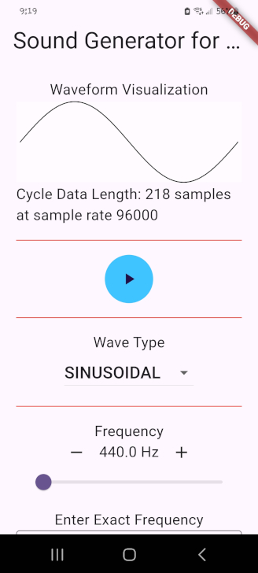
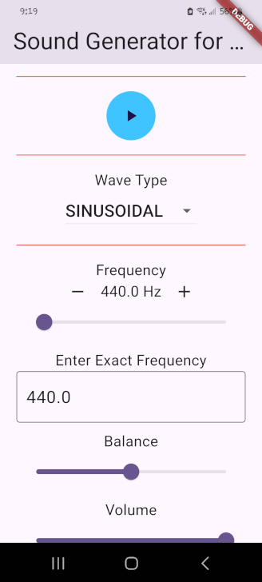
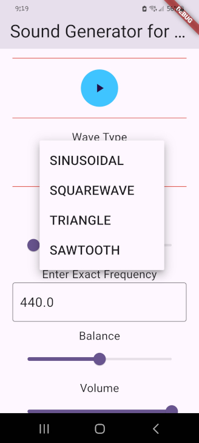

# Wave Sound Generator

A Flutter application that generates and visualizes waveforms (e.g., sine, square, triangle) with real-time audio output. Adjust frequency, volume, balance, and wave type, and see the waveform on-screen.

## Features
- Real-time waveform visualization.
- Interactive controls:
  - Frequency (20 Hz to 10,000 Hz) via slider, buttons, or text input.
  - Volume and balance sliders.
  - Wave type selection (sinusoidal, square, triangle, etc.).
- Cross-platform: Android, iOS, macOS, Linux, Windows, Web.
- Powered by the `sound_generator` package.

## Screenshots




## Prerequisites
- [Flutter SDK](https://flutter.dev/docs/get-started/install) (3.0.0+)
- Dart SDK (included with Flutter)
- Code editor (e.g., VS Code, Android Studio)
- Device/emulator or web browser for testing

## Setup
1. **Clone the repository**:
   ```bash
   git clone https://github.com/nirblu/WaveSoundGenerator.git
   cd cymatics
   ```
2. **Install dependencies**:
   ```bash
   flutter pub get
   ```
3. **Run the app**:
   ```bash
   flutter run
   ```
   For web:
   ```bash
   flutter run -d chrome
   ```

## Usage
- Press play/stop to control audio.
- Adjust frequency using the slider, +/- buttons, or text field.
- Select wave type from the dropdown.
- Modify volume and balance with sliders.
- View the real-time waveform visualization.

## Project Structure
- `lib/`: Dart source code (`main.dart`, `sinewave_screen.dart`).
- `pubspec.yaml`: Dependencies and metadata.
- Platform folders (`android`, `ios`, etc.): Cross-platform configs.
- `test/`: Unit tests (to be added).

## Dependencies
- `flutter`: Core framework.
- `sound_generator`: Waveform and audio generation.

## Contributing
1. Fork the repo.
2. Create a branch (`git checkout -b feature/your-feature`).
3. Commit changes (`git commit -m "Add feature"`).
4. Push (`git push origin feature/your-feature`).
5. Open a pull request.

## License
MIT License - see [LICENSE](LICENSE) for details.

## Contact
Open an issue or contact [contact@nirblu.com] for feedback.
